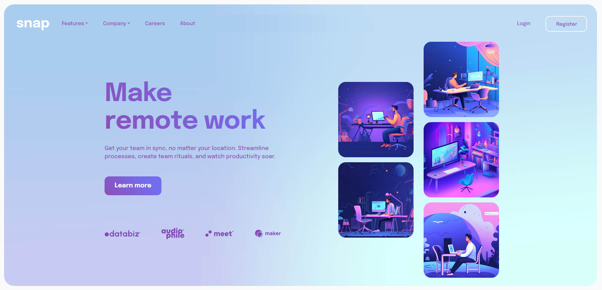

# Frontend Mentor - Intro section with dropdown navigation solution

This is a solution to the [Intro section with dropdown navigation challenge on Frontend Mentor](https://www.frontendmentor.io/challenges/intro-section-with-dropdown-navigation-ryaPetHE5). Frontend Mentor challenges help you improve your coding skills by building realistic projects. 

## Table of contents

- [Overview](#overview)
  - [The challenge](#the-challenge)
  - [Screenshot](#screenshot)
  - [Links](#links)
- [My process](#my-process)
  - [Built with](#built-with)
  - [What I learned](#what-i-learned)
  - [Continued development](#continued-development)
  - [Useful resources](#useful-resources)
- [Author](#author)
- [Acknowledgments](#acknowledgments)

## Overview

### The challenge

Users should be able to:

- View the relevant dropdown menus on desktop and mobile when interacting with the navigation links
- View the optimal layout for the content depending on their device's screen size
- See hover states for all interactive elements on the page

### Screenshot

- Main: 
- 

### Links

- Solution URL: [https://github.com/Jo-cloud85/intro-section-with-dropdown.git](https://github.com/Jo-cloud85/intro-section-with-dropdown.git)
- Live Site URL: [https://jo-cloud85.github.io/intro-section-with-dropdown/](https://jo-cloud85.github.io/intro-section-with-dropdown/)

## My process

### Built with

- Semantic HTML5 markup
- CSS custom properties
- Flexbox
- CSS Grid
- Mobile-first workflow
- [Bootstrap](https://getbootstrap.com/docs/5.3/components/navbar/) - Frontend library
- [Styled Components](https://styled-components.com/) - For styles

### What I learned

This is my first time doing a loading page. I learned about how to create a loading page in general.

### Useful resources

- [How to Create a CSS Page Loading Spinner - Web Design Tutorial](https://www.youtube.com/watch?v=-HS9IIuT_Mo&t=47s)
- [Hex Color To CSS Filter Converter](https://isotropic.co/tool/hex-color-to-css-filter/)
- [CSS Text Gradient Generator](https://www.cssportal.com/css-text-gradient-generator/)
= [Mesh](https://meshgradient.com/)

## Author

- Frontend Mentor - [@Jo-cloud85](https://www.frontendmentor.io/profile/Jo-cloud85)

## Acknowledgments

- [https://www.awsmd.com/](https://www.awsmd.com/) - This is the main design reference I took from in redesigning this landing page.
- [https://uiverse.io/Shoh2008/bad-lionfish-99](https://uiverse.io/Shoh2008/bad-lionfish-99) - This is the loader design I adapted from for my loading page.